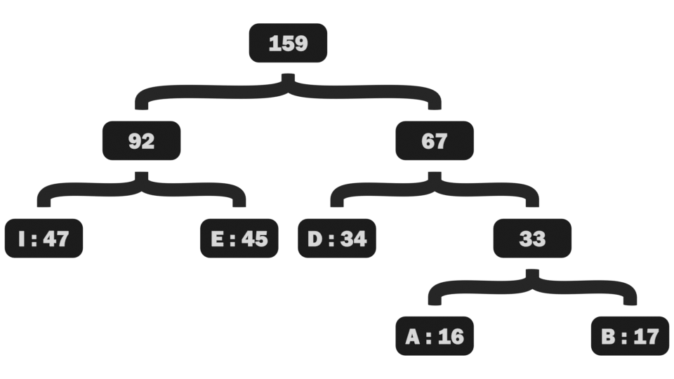

# Huffman Coding

Huffman Coding written in .NET 8.0 C#

## Overview of Huffman Coding:

Under the ASCII encoding standard a single character takes up 1 byte or 8 bits, Huffman coding instead attempts to minimize the number of bits used to encode the most common characters at the expense of the least used characters. Meaning commonly used characters will use fewer than 8 bits but an uncommon chatacter might use more than 8 bits. The goal is that on average it uses fewer bits per character.

## How to Use:

All the functionality needed to serialize and deserialize text is inside the [HuffmanSerializer](HuffmanSerializer.cs) class which converts the input text and Huffman tree needed to decode it to binary data and back again.

To serialize the data simply call the .SerializeText function to get the binary data as a byte[]:

````
byte[] filePayload = HuffmanSerializer.SerializeText(originalText);
````

And to deserialize it back to a string you put the serialized data into the .DeserializeText function:

````
string originalText = HuffmanSerializer.DeserializeText(filePayload);
````

## How Huffman Coding Works:

Huffman coding works by taking the input string and generating a Huffman tree from it, which places the most frequently used characters near the top and the least used characters at the bottom, then when encoding a character we write the path used to nagivate to the character in the tree.

The tree itself has two types of nodes, a character / element nodes which store the character along with it's frequency and structure nodes that store connections to other nodes and the combined frequency of all the nodes connected below it.

When decoding the characters we follow the path back down the Huffman tree, when we get to a character node we know we've reached the end and can move on to the next character. This is how Huffman coding saves space, we don't need to have a fixed amount of bits to encode a character, the tree tells us when we stop reading one character and start reading the next in the bit sequence.

To generate a Huffman tree, we calculate the frequencies of all the characters, the frequency being how many times it appears in the input string, placing all those as character nodes in a collection. Then we remove the two lowest frequency nodes from the collection and connect them up to a structure node, adding that structure node back into the collection. Repeate until there is only one node left in the collection, which is now our root node.



The Huffman tree also needs to be stored in order to decode the text, which manes for smaller strings this doesn't save as much space and might even take up more space.